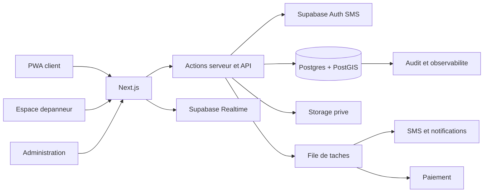
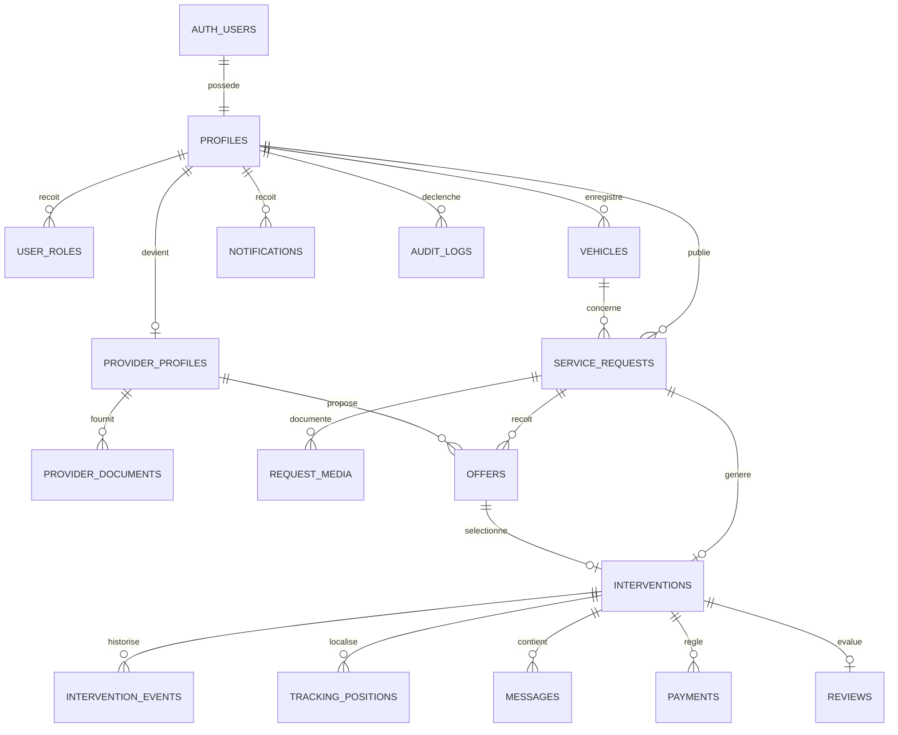

# DepanUp - Plan directeur de la version professionnelle

**Statut :** blueprint V2 a valider avant implementation
**Date :** septembre 2026
**Lancement :** Casablanca et Rabat
**Produit :** PWA responsive unique, espaces client et depanneur separes
**Socle :** Next.js, TypeScript et Supabase

---

## 1. Point de depart

La V2 est un nouveau produit. Le prototype actuel sert uniquement a confirmer que le parcours de mise en concurrence est comprehensible. Son code, son stockage, son logo, ses couleurs et ses composants ne sont pas des references pour la nouvelle version.

La nouvelle application sera un **monolithe modulaire** : un produit deployable, mais divise en domaines metier independants, testes et proteges par des frontieres claires. Ce choix donne une architecture professionnelle sans introduire trop tot la complexite de microservices.

### Promesse produit

> Trouver rapidement un depanneur fiable, connaitre le prix avant son arrivee et suivre l'intervention jusqu'a sa fin.

### Principes non negociables

1. La securite et la confiance passent avant le nombre de fonctionnalites.
2. Une position GPS exacte n'est jamais publique.
3. Toute action sensible est autorisee et journalisee cote serveur.
4. L'interface reste utilisable d'une main, dehors, sous stress et avec un reseau mediocre.
5. Le francais est livre en premier, mais l'arabe et le RTL sont prevus des le socle.
6. La marketplace de pieces commence seulement apres validation du service de depannage.

---

## 2. Identite de marque

### Nom choisi : DepanUp

Le nom est direct et immediatement comprehensible. Il place le service avant une marque abstraite.

Il presente toutefois un risque important : `depannage` est un terme generique. Sa protection comme marque peut etre faible, les domaines courts sont probablement occupes et le referencement sera tres concurrentiel. Avant de l'utiliser commercialement, il faut :

- verifier la disponibilite aupres de l'OMPIC dans les classes pertinentes ;
- verifier les domaines `.ma` et `.com`, les reseaux sociaux et les boutiques mobiles ;
- faire valider par un conseil en propriete intellectuelle la possibilite de proteger le mot-symbole et surtout le symbole graphique ;
- definir un nom legal distinct si le mot seul n'est pas enregistrable.

Cette verification ne bloque pas le design system ni le prototype produit. Le symbole graphique doit etre suffisamment distinctif pour porter l'identite meme si le nom reste descriptif.

### Signature recommandee

**Un depanneur. Un prix. Maintenant.**

Elle explique le modele en trois temps : professionnel, transparence, rapidite.

### Logo recommande

Le logo associe un mot-symbole `DepanUp` a un symbole autonome :

- la lettre `D` dessine une boucle de route ;
- une ouverture dans le `D` forme une fleche vers l'avant ;
- deux traits centraux evoquent le marquage routier ;
- la forme reste lisible a 24 px et en une seule couleur ;
- aucune depanneuse detaillee, cle plate, croix medicale ou eclair generique ;
- variantes obligatoires : horizontale, symbole seul, monochrome, fond clair et fond sombre.

Le symbole doit fonctionner sur un favicon, une application installee, un gilet, une facture et un vehicule d'intervention. Le logo est vectoriel, mais les illustrations et photos du produit restent des images reelles.

### Palette choisie

| Role | Nom | Couleur | Usage |
|---|---|---:|---|
| Marque et action | Rouge signal | `#D9382B` | CTA principal, marque, urgence |
| Texte et navigation | Carbone | `#17201E` | Texte principal, entetes |
| Fond principal | Craie | `#F6F7F3` | Pages et zones de respiration |
| Surface | Blanc | `#FFFFFF` | Formulaires, listes et feuilles mobiles |
| Succes | Vert arrivee | `#087F5B` | Arrive, termine, paiement confirme |
| Attention | Ambre securite | `#F2B134` | Retard, verification, especes |
| Information | Bleu trajet | `#176B87` | Carte, trajet, information neutre |
| Bordure | Gris beton | `#D8DEDA` | Separateurs et controles |
| Texte secondaire | Gris route | `#5D6965` | Metadonnees et aide |

Le rouge n'est pas decoratif : il identifie l'action prioritaire. L'ambre recoit toujours un texte sombre. Tous les couples texte/fond doivent atteindre WCAG 2.2 AA.

### Typographie et iconographie

- **Titres et marque :** Alexandria, expressive et compatible latin/arabe.
- **Interface et donnees :** IBM Plex Sans, puis IBM Plex Sans Arabic.
- **Icones :** Lucide, avec libelle visible pour toute action ambigue.
- Pas de texte long en capitales, de lettre serree artificiellement ou de taille calculee avec la largeur de l'ecran.

### Ton editorial

- phrases courtes et concretement actionnables ;
- vouvoiement constant ;
- pas de superlatifs invraisemblables ;
- distinction explicite entre prix estime, prix propose et prix final ;
- messages calmes dans les situations d'erreur ;
- aucune statistique marketing sans source verifiable.

---

## 3. Direction d'experience

L'application ressemble a un outil d'intervention, pas a une landing page SaaS. Le premier ecran rend l'action urgente immediatement accessible.

### Regles d'interface

- conception mobile d'abord ;
- zones tactiles d'au moins 44 x 44 px ;
- navigation client limitee a `Demander`, `Interventions`, `Compte` ;
- carte plein cadre quand la localisation est la tache principale ;
- feuilles basses sur mobile pour les offres et les actions de trajet ;
- aucun empilement de cartes dans des cartes ;
- texte et icone pour les etats, jamais la couleur seule ;
- confirmation forte pour acceptation, annulation, paiement et fin d'intervention ;
- reprise explicite apres perte de connexion ;
- skeletons sobres plutot que spinners permanents ;
- animations limitees et respect de `prefers-reduced-motion` ;
- focus visible, navigation clavier et annonces `aria-live`.

### Ecran d'accueil

Le premier viewport ne sera pas une page marketing abstraite. Il contient :

1. le logo et un acces au compte ;
2. le titre `De quel depannage avez-vous besoin ?` ;
3. les categories principales sous forme de controles tactiles ;
4. un bouton `Utiliser ma position` ;
5. un CTA rouge `Demander un depanneur` ;
6. un acces secondaire `Vous etes depanneur ?` ;
7. une photographie reelle d'une intervention au Maroc, claire et inspectable.

Les preuves de confiance viennent ensuite : fonctionnement, verification, prix, securite et couverture geographique. Elles ne contiennent aucune donnee fictive.

### Parcours client

| Route indicative | Objectif |
|---|---|
| `/` | Demarrer une demande sans chercher dans un menu |
| `/connexion` | Telephone, OTP, consentements et recuperation |
| `/demander` | Vehicule, panne, photos, position et recapitulatif |
| `/demandes` | Demandes actives et historique du client connecte |
| `/demandes/[id]/offres` | Comparer prix, ETA, identite et capacites |
| `/interventions/[id]` | Suivre le depanneur, communiquer et gerer l'intervention |
| `/interventions/[id]/avis` | Evaluer une intervention terminee |
| `/compte` | Profil, vehicules, langue et confidentialite |
| `/securite` | Verification, annulation et partage du trajet |
| `/legal/*` | CGU, confidentialite, cookies et annulation |

### Parcours depanneur

| Route indicative | Objectif |
|---|---|
| `/pro/inscription` | Creer un compte professionnel et choisir ses zones |
| `/pro/verification` | Fournir CIN, permis, carte grise et assurance |
| `/pro/demandes` | Voir les demandes eligibles sur carte et liste |
| `/pro/demandes/[id]` | Consulter le besoin et soumettre une offre |
| `/pro/interventions/[id]` | Naviguer et mettre a jour l'etat de l'intervention |
| `/pro/activite` | Historique, revenus et indicateurs utiles |
| `/pro/compte` | Documents, vehicule, disponibilite et zones |

### Administration minimale

L'administration initiale couvre uniquement :

- verification et expiration des documents depanneur ;
- suspension et reactivation de compte ;
- recherche de demande ou d'intervention ;
- litiges, remboursements et no-show ;
- journal d'audit.

Elle ne devient pas un constructeur de contenu ou un back-office generique.

---

## 4. Architecture cible



### Choix structurants

- Next.js en mode serveur ; la V2 n'est plus un export statique.
- TypeScript strict pour l'application, les scripts et les tests.
- Supabase Auth pour les OTP telephone, avec fournisseur SMS et limites anti-abus.
- PostgreSQL comme source de verite et PostGIS pour les zones et rayons.
- RLS sur toute table exposee par Supabase.
- Actions serveur ou fonctions SQL transactionnelles pour les commandes sensibles.
- Realtime pour les offres, messages et changements d'etat.
- Storage prive et URLs signees courtes pour les photos et documents.
- Taches asynchrones pour SMS, expiration, relances et webhooks.
- PWA installable, mais sans promettre le GPS en arriere-plan comme une application native.

### Structure du nouveau depot

```text
src/
  app/
    (public)/
    (client)/
    (provider)/
    (admin)/
    api/
  modules/
    auth/
    profiles/
    vehicles/
    requests/
    offers/
    interventions/
    tracking/
    messaging/
    payments/
    reviews/
    provider-verification/
    notifications/
  shared/
    ui/
    validation/
    permissions/
    errors/
    observability/
  lib/
    supabase/
    env/
    i18n/
supabase/
  migrations/
  functions/
  seed/
  tests/
tests/
  unit/
  integration/
  e2e/
docs/
  adr/
  product/
```

Chaque module possede ses schemas Zod, commandes, lectures, composants et tests. Les pages orchestrent les modules ; elles ne contiennent pas les regles metier.

---

## 5. Schema professionnel



### Tables essentielles

| Table | Responsabilite |
|---|---|
| `profiles` | Identite applicative, nom, telephone verifie, langue et statut |
| `user_roles` | Client, depanneur, administrateur, puis vendeur |
| `vehicles` | Vehicules clients reutilisables |
| `provider_profiles` | Entreprise, disponibilite, zones, capacites et verification |
| `provider_documents` | Metadonnees des documents prives et decisions de controle |
| `service_requests` | Panne, position privee, zone approximee et statut |
| `request_media` | Photos privees et metadonnees de moderation |
| `offers` | Prix, ETA, message, expiration et statut |
| `interventions` | Offre acceptee, acteurs, prix fige et etat operationnel |
| `intervention_events` | Historique append-only des transitions et de leur auteur |
| `tracking_positions` | Positions temporaires avec retention courte |
| `messages` | Conversation d'une intervention autorisee |
| `payments` | Mode, montant, commission, statut et idempotence |
| `reviews` | Avis unique lie a une intervention terminee |
| `notifications` | Evenements a remettre par push, SMS ou interface |
| `audit_logs` | Actions administratives et operations sensibles |

Les montants sont des entiers dans la plus petite unite acceptee. Les dates sont en UTC. Les identifiants sont des UUID. Les suppressions et durees de retention sont definies avant toute collecte.

### Machines d'etat

```text
Demande : brouillon -> publiee -> attribuee -> fermee
                       |              |
                       +-> expiree    +-> annulee

Offre : soumise -> acceptee
           |  |  +-> expiree
           |  +----> refusee
           +-------> retiree

Intervention : attribuee -> en_route -> arrivee -> en_cours -> terminee
                   |           |          |             |
                   +-----------+----------+-------------+-> annulee / no_show

Paiement : en_attente -> especes_a_confirmer / autorise -> paye
              |                                      |
              +-> echoue / conteste                  +-> rembourse
```

L'acceptation d'une offre est atomique : verrouiller la demande, verifier le proprietaire et l'etat, accepter une seule offre, expirer les autres, creer l'intervention et figer le prix. Un double clic ou deux appareils ne peuvent jamais creer deux gagnants.

---

## 6. Autorisations et confidentialite

| Ressource | Client | Depanneur verifie | Administrateur |
|---|---|---|---|
| Demande complete | Proprietaire | Seulement si attribuee | Acces audite selon mission |
| Demande approximee | Proprietaire | Eligible dans sa zone | Acces audite selon mission |
| Offre | Offres de sa demande | Ses propres offres | Support audite |
| Intervention | Participant | Participant | Support audite |
| Documents KYC | Aucun acces | Ses documents | Verificateur autorise |
| Position en direct | Participant | Participant | Acces exceptionnel audite |

### Exigences de securite

- RLS testee automatiquement, y compris les refus attendus.
- Aucun secret dans une variable `NEXT_PUBLIC_*`.
- Validation Zod aux frontieres et contraintes SQL en profondeur.
- OTP limite par telephone, IP et appareil.
- Signatures et idempotence des webhooks verifiees.
- Documents KYC dans un bucket prive avec URL signee courte.
- Sauvegardes testees, rotation des secrets et chiffrement en transit.
- Journal des roles, verifications, remboursements et acces support.
- Retention definie pour GPS, documents, messages et comptes supprimes.
- Cadrage Loi 09-08, CNDP, CGU et sous-traitants avant le pilote public.

---

## 7. Plan de livraison etape par etape

### Etape 0 - Marque et cadrage terrain

**Duree : 1 a 2 semaines**

**Avancement : en cours**

- [x] Trois concepts vectoriels du symbole `D-route` dans [`docs/brand/logo-concepts.svg`](docs/brand/logo-concepts.svg).
- [x] Direction recommandee et exports dans [`docs/brand/brand-system.md`](docs/brand/brand-system.md).
- [x] Prototype client responsive dans [`docs/prototype-v2/index.html`](docs/prototype-v2/index.html).
- [ ] Recherche juridique, domaines et identifiants.
- [ ] Entretiens terrain a Casablanca et Rabat.
- [ ] Regles de prix, annulation, no-show, litige et especes.
- [ ] Fournisseur SMS, cout et delivrabilite.
- [ ] Objectifs chiffres du pilote.

- verifier juridiquement `DepanUp`, les domaines et les identifiants ;
- produire trois variantes du symbole `D-route` et tester leur lisibilite ;
- interroger au moins 10 clients et 10 depanneurs dans chaque ville ;
- ecrire les regles de prix, annulation, no-show, litige et especes ;
- confirmer le fournisseur SMS, son cout et sa delivrabilite ;
- definir les objectifs du pilote et les evenements analytics.

**Livrable :** identite exploitable, prototype Figma teste et regles metier signees.

### Etape 1 - Fondations d'ingenierie

**Duree : 1 semaine**

- initialiser la nouvelle application TypeScript stricte ;
- poser les tokens visuels et les composants accessibles ;
- preparer i18n et RTL sans traduire encore toute l'interface ;
- configurer Supabase local, migrations, environnements et secrets ;
- installer ESLint, formatage, Vitest, Playwright, axe et CI ;
- ajouter Sentry, logs structures et analytics soumis au consentement.

**Livrable :** preview par pull request et aucune table accessible sans RLS.

### Etape 2 - Comptes, roles et verification

**Duree : 2 a 3 semaines**

- connexion par telephone et OTP ;
- profils client, depanneur et administrateur ;
- onboarding et depot prive des documents depanneur ;
- revue manuelle, rejet motive et expiration documentaire ;
- tests RLS complets pour chaque role.

**Livrable :** un depanneur non verifie ne peut ni consulter les demandes ni proposer un prix.

### Etape 3 - Coeur de la marketplace

**Duree : 3 a 4 semaines**

- vehicules et demande avec photos ;
- recherche PostGIS par zone et capacite ;
- position approximee avant attribution ;
- offres avec prix, ETA, expiration et retrait ;
- acceptation transactionnelle d'une seule offre ;
- notifications et mises a jour Realtime.

**Livrable :** deux telephones distincts accomplissent publier, proposer et accepter sans polling.

### Etape 4 - Execution de l'intervention

**Duree : 2 a 3 semaines**

- cycle complet de l'intervention ;
- suivi GPS a frequence adaptative et retention courte ;
- ETA, carte et partage securise avec un proche ;
- messagerie et notifications de retard ;
- annulation, no-show et journal d'evenements.

**Livrable :** chaque transition est autorisee, horodatee et visible aux deux participants.

### Etape 5 - Paiement et confiance

**Duree : 3 a 4 semaines**

- especes comme mode de premiere classe avec confirmation bilaterale ;
- preparation de la carte via CMI ou prestataire valide ;
- commission, factures et rapprochement ;
- avis uniquement apres intervention terminee ;
- litiges, remboursements et support minimal.

**Livrable :** chaque intervention est rapprochable et chaque avis est authentique.

### Etape 6 - Pilote Casablanca et Rabat

**Duree : 4 semaines minimum**

- recruter et verifier 30 a 50 depanneurs actifs par ville ;
- ouvrir par zones et plages horaires, pas nationalement ;
- assurer un support humain et une revue quotidienne des incidents ;
- tester la charge, la restauration de sauvegarde et la gestion d'incident ;
- mesurer offres, acceptation, ETA reel, completion, annulation et recurrence.

Le lancement dans deux villes exige deux fois plus de densite. Si le seuil n'est pas atteint, Casablanca puis Rabat ouvrent successivement plutot que simultanement.

**Livrable :** quatre semaines avec objectifs de service atteints et aucun incident critique non traite.

### Etape 7 - Pieces et consommables

Cette etape commence uniquement apres validation du pilote et des paiements. Le premier catalogue reste limite aux batteries, pneus, ampoules, essuie-glaces, filtres et huile. Compatibilite, stock, garantie et retours sont modelises avant la premiere vente.

---

## 8. Definition de termine

Une fonctionnalite n'est terminee que si :

- ses regles metier et permissions sont ecrites ;
- ses migrations sont reversibles et testees ;
- ses lectures et mutations respectent la RLS ;
- les etats vide, chargement, hors ligne, erreur et succes existent ;
- elle fonctionne sur mobile, clavier et lecteur d'ecran ;
- ses chaines sont externalisees et compatibles RTL ;
- les evenements produit et erreurs techniques sont observables ;
- les tests unitaires, integration et E2E pertinents passent ;
- aucune donnee sensible n'apparait dans les logs ou analytics.

### Portes CI

```text
format -> lint -> typecheck -> unit -> migrations -> RLS -> integration -> build -> E2E -> accessibilite
```

Un deploiement de production exige une approbation, une sauvegarde, un plan de retour et des alertes actives.

---

## 9. Indicateurs du pilote

### Indicateur principal

**Pourcentage de demandes publiees qui deviennent une intervention terminee.**

### Garde-fous

- delai avant la premiere offre ;
- nombre d'offres pertinentes par demande ;
- ETA annonce contre ETA reel ;
- taux d'annulation client et depanneur ;
- taux de no-show ;
- taux de completion et de litige ;
- incidents de securite et de confidentialite ;
- marge nette apres SMS, paiement et support ;
- retention client et depanneur a 30 jours.

---

## 10. Decisions encore necessaires

1. Resultat de la recherche juridique et des domaines pour `DepanUp`.
2. Fournisseur SMS et cout cible par connexion reussie.
3. Regles exactes d'annulation, no-show et litige.
4. Commission, traitement des especes et responsabilite de facturation.
5. Liste des documents KYC et duree de validite avec conseil juridique.
6. Zones d'ouverture precises dans Casablanca et Rabat.
7. Prestataire cartographique et cout au volume du pilote.
8. Objectifs chiffres permettant de passer du pilote au lancement.

Tant que les decisions 2 a 5 ne sont pas arretees, l'equipe peut construire le design system, l'authentification et le squelette de donnees, mais ne doit pas figer le paiement ni les transitions d'annulation.